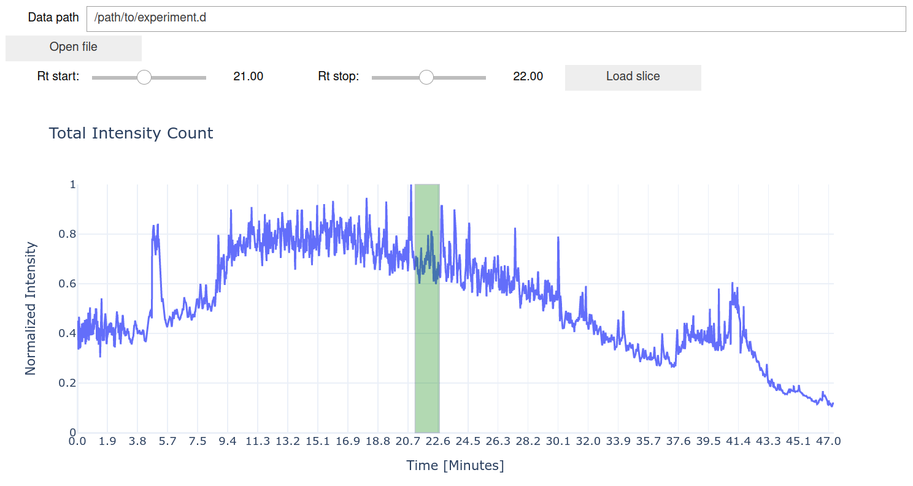
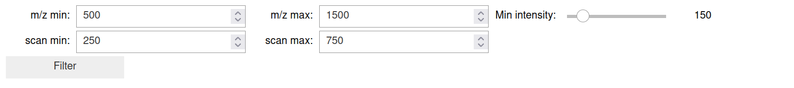
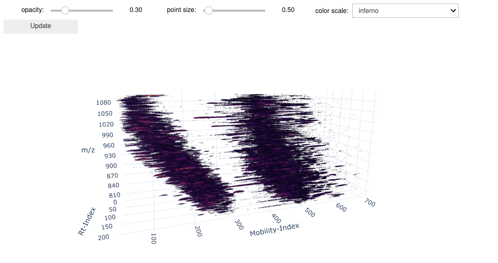
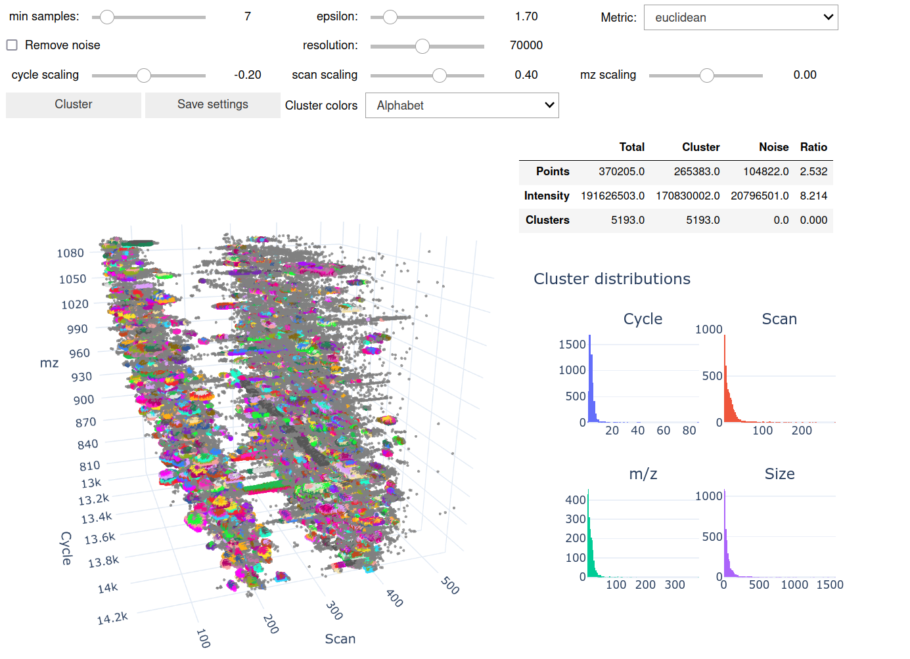

# proteolizard-vis
A collection of python classes and widgets to visualize timsTOF raw-data.

<p align="center">
  
</p>

# Context


# Dependencies
proteolizard-vis depends on [```proteolizard-data```](https://github.com/theGreatHerrLebert/proteolizard-data), which is 
necessary for raw data access, querying, and filtering.

# Installation
We recommend to install ```proteolizard-vis``` into a separate [python virtual environment](https://docs.python.org/3/tutorial/venv.html). 
Once activated, you can install the package into it as follows: 
```
git clone https://github.com/theGreatHerrLebert/ionmob.git
cd proteolizard-vis
pip install -e .
```

# Data access and filtering

## General concepts

## Visual selection of a slice of data

```python
from proteolizarddata.data import PyTimsDataHandleDDA
from proteolizardvis.data import DDADataLoader

data_loader = DDADataLoader()
data_loader.display_widgets()
```

<p align="center">
  
</p>

## Visual filtering of data

```python
from proteolizardvis.filter import DDAPrecursorFilter

precursor_filter = DDAPrecursorFilter(data_loader=data_loader)
precursor_filter.display_widgets()
```

<p align="center">
  
</p>


# Plotting

## Point clouds

```python
from proteolizardvis.point import DDAPrecursorPointCloudVis

precursor_pointcloud_vis = DDAPrecursorPointCloudVis(precursor_filter)
precursor_pointcloud_vis.display_widgets()
```

<p align="center">
  
</p>

## Surface Plots

```python
from proteolizardvis.surface import TimsSurfaceVisualizer

surface_vis = TimsSurfaceVisualizer(data_loader=data_loader, data_filter=precursor_filter)
surface_vis.display_widgets()
```

<p align="center">
  
</p>

## Applying algorithms to raw data and visualize results

```python
from proteolizardvis.cluster import DBSCANVisualizer

dbscan_vis = DBSCANVisualizer(data=precursor_filter)
dbscan_vis.display_widget()
```

<p align="center">
  
</p>

## Bringing it all together

```python